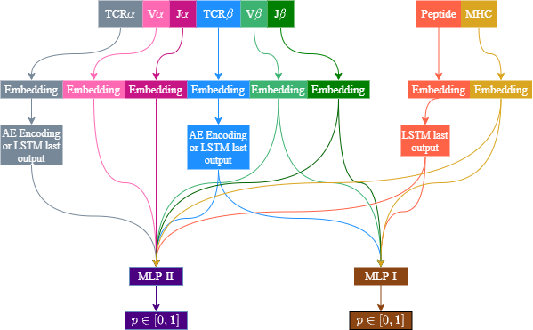

# ERGO-II
We have previously published [ERGO](https://github.com/louzounlab/ERGO), a deep learning based method
for predicting TCR and epitope peptide binding.
Several evaluation methods were suggested, including Single Peptide Binding (SPB), Multi Peptide Selection (MPS) and
TCR Peptide Pairing (TPP).

ERGO uses only the TCRβ CDR3 sequence and the peptide sequence for the binding prediciton.
We have now developed **ERGO-II**, an updated method for TCR-peptide binding prediction.
ERGO-II includes other relevant features such as TCRα sequence, V and J genes, MHC and T-cell type (CD4/CD8).
The new ERGO-II configuration is flexible, allowing to include only partial feature information.

## Model Flow


The architecture is flexible to several feature configurations.
TCRβ and peptide sequences are always used, while V and J gene usage is optional.
TCRα sequence usage is optional. Vα and Jα are only used when TCRα is used. MHC usage is optional.
TCRs are encoded with autoencoder or LSTM. Peptides are always encoded with LSTM.
Other features (except for T-Cell type which is not illustrated) are encoded using a learned embedding matrix.
Two MLP are used, one for samples including TCRα and the other for samples missing the TCRα sequence.

## Requirements
ERGO-II is built using [PytorchLightning](https://github.com/PyTorchLightning/pytorch-lightning), a PyTorch wrapper.
See [the requirements file](requirements.txt).

## Prediction Instructions
We recommend using the [ERGO-II web-tool](http://tcr2.cs.biu.ac.il/home) for predicting binding scores.
The website allows flexible selection of the model configuration.
However, the web-tool is limited to predict up to 50,000 pairs at a time.
For longer files you can use the models available in this repository.
Note that due to the model size we include here only two ERGO-II models,
one for the McPAS database and one for VDJdb.

Run:
```commandline
python Predict.py dataset file
```
Where `dataset` is `mcpas` or `vdjdb` and `datafile` is the csv file to predict.
See the website and [this example](example.csv) for the right datafile format.

## References
[1] Springer I, Besser H, Tickotsky-Moskovitz N, Dvorkin S and Louzoun Y (2020),
Prediction of Specific TCR-Peptide Binding From Large Dictionaries of TCR-Peptide Pairs.
*Front. Immunol. 11:1803.* [doi: 10.3389/fimmu.2020.01803.](https://www.frontiersin.org/articles/10.3389/fimmu.2020.01803/full)

[2] Springer I, Tickotsky N and Louzoun Y (2021),
Contribution of T Cell Receptor Alpha and Beta CDR3, MHC Typing, V and J Genes to Peptide Binding Prediction.
*Front. Immunol. 12:664514.* [doi: 10.3389/fimmu.2021.664514](https://www.frontiersin.org/articles/10.3389/fimmu.2021.664514/full)

